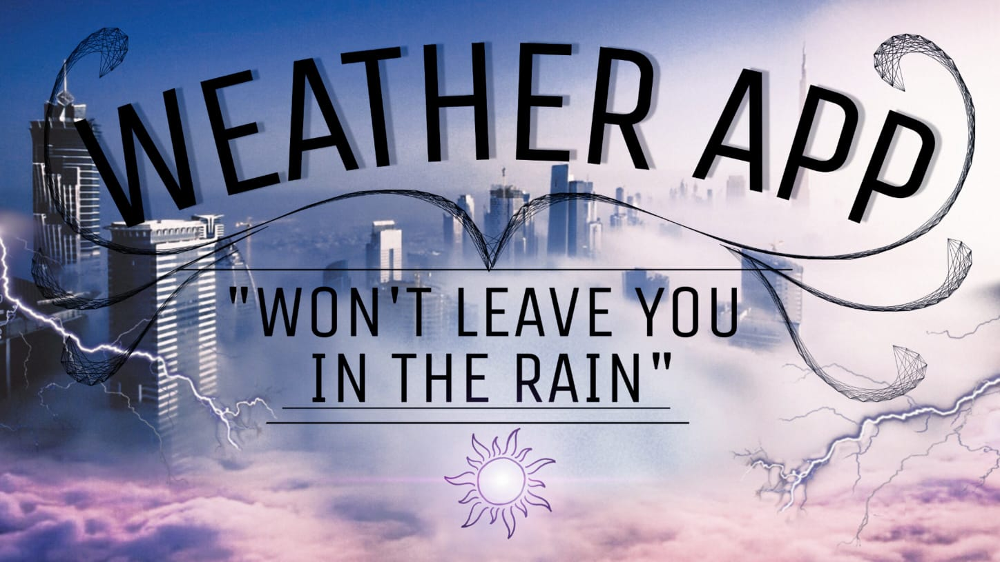
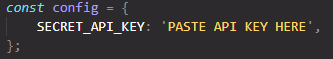

A weather application that displays the current weather forecast based on your location.

A live demo can be found [here](https://hendriktreuner.me/weather-app)

## Description

This project is created for the purpose of learning how to interact with APIs and how to extract and filter data sent by them.

What it does:

-   Display the current location, time and weather
-   Display a daily forecast for the next upcoming 7 days including Weekday, weather, minimum & maximum temperature
-   Display a temperature graph in a 2-hours-step-interval for the upcoming 14 hours

## Technologies

-   Plain HTML/CSS/JS
-   OpenWeatherMap API (to fetch the Weather Data)
-   Geolocation API (Built in Browser API)
-   OpenStreetMap API (for reverse geocoding)

## Browser Support & Testing

The website is tested and works on Chrome, Edge, FireFox and Opera.

## How to install

-   Download the source code
-   Get your own API key on [OpenWeatherMap](https://openweathermap.org/)
-   Create a file called "config.js". Store your unique API key there
-   The file should look like this:
-   

-   Store the newly created "config.js" file in the "scripts" folder
